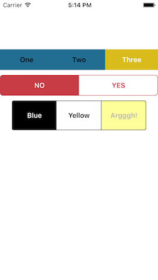
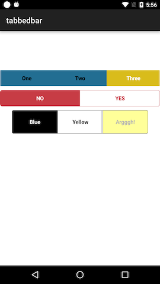

#Tabbed Bar Widget

Cross-platform segmented control (TabbedBar) widget for Appcelerator Titanium apps, by @skypanther




This is an Alloy widgetized version of my old segmented control component with some updated code and options.

Note: This widget uses a custom component on both iOS and Android. In other words, it does not fall back to Ti.UI.iOS.TabbedBar.

## Installation and usage

Once this is indexed by Gitt.io you'll be able to install that way. Till then...

1. Download this repo (git clone, zip, whatever)
2. Copy the widgets/com.skypanther.segmentedcontrol to your project's widgets folder
3. Update your app/config.json to add:

```json
"dependencies": {
    "com.skypanther.segmentedcontrol": "1.0"
}
```

In your XML file, add the widget:

```xml
<Widget src="com.skypanther.segmentedcontrol" id="tbar" top="100"/>
```

Add styling as desired in your tss:

```
"#tbar": {
	borderRadius: 6,
	borderColor: "#C73C45",
	selectedButtonColor: "#C73C45",
	unselectedButtonColor: "#fff", 
	selectedButtonTextColor: "#fff",
	unselectedButtonTextColor: "#C73C45",
	index: 0,
	font: {
		fontWeight: 'bold',
		fontSize: '15'
	}
}
```

Initialize it in the controller:

```javascript
$.tbar1.init(['One', 'Two', 'Three'], callback);

function callback(index) {
	alert('You clicked button ' + (index+1));
}
```

## Styling options

You can set these style options in the TSS or in your XML tag.

|Property|Description|Default|
|-------|---|-----------|
|`selectedButtonColor`|background color of the<br/>selected button|`#d9bc1b` (yellow)|
|`unselectedButtonColor` |background color of buttons<br/>that are not selected |`#226e92` (blue) |
|`selectedButtonTextColor` |color of text on the selected<br/>button |`#fff` |
|`unselectedButtonTextColor` |color of text on unselected<br/>buttons | `#000`|
|`disabledTextColor `|color of text on a disabled<br/>button | `#aaa` (light grey)|
|`disabledButtonBackgroundColor` |background color of a<br/>disabled button | `#444` (dark grey)|
|`font` | font properties of the button<br/>labels | `{fontFamily: 'Avenir-Light', fontSize: 11}` (ios)<br/>`{fontWeight: 'normal', fontSize: '15dp'}` (android)| 

Additionally, most other properties you set on the widget (via its xml tag or id/class selectors) will be passed down to the widget's components.

## Methods

|Method|Notes|
|-------|--------------|
|`init(labels, callback)`|You must call this method to initialize the control, passing to it an array of labels and a function to be called when a button is tapped. That function will receive a single parameter, the `index` of the button that was tapped|
|`select(num)`| Selects the button specified|
|`deselect(num)`| Deselects (unselects) the button specified|
|`enable()`| Enables click events for the whole control|
|`disable()`| Disables click events for the whole control|
|`deselectAll()`|Deselects all the buttons in the control|
|`disableButton(num)`|Disables the specified button, making it unclickable while the rest remain clickable|
|`enableButton(num)`|Enables the specified button, making it clickable.|
|`disableAllButtons()`|Disable all buttons, making them all unclickable. Essentially the same as `disable()`|
|`enableAllButtons()`|Enable all buttons, making them all clickable unless you have called `disable()`. In that case, you'd need to call `enable()`|

# Limitations

* I have not tested this with more than 3 buttons. Too many and it will surely fail. 
* I haven't tested it on a tablet. Layout might be screwed up.
* I'm pretty sure it won't handle rotation of the device well.
* It doesn't support anything fancy, like icons instead of text on the buttons.
* The `callback()` function should probably get an `e` object with more than just the `index` property.

Contributions are welcome!

#License / Copyright

&copy; 2016 Tim Poulsen

MIT licensed